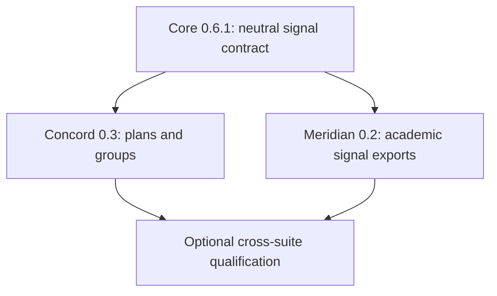

# Paper Data Suite: Pilot Readiness and Teacher-Workflow Development Plan

**Planning date:** August 17, 2026  
**Planning context:** Private, teacher-local pilot used alongside school-approved systems  
**Primary user:** Stephen Severino  
**Repositories covered:** Paper Data Suite suite repository, Core, ScoreForm, Quillan, Concord, Meridian, Vitrine, and Portia

## 1. Purpose of this plan

This document converts the pilot-readiness and ease-of-use audit into a GitHub development program that follows the established Paper Data Suite workflow:

1. create a milestone;
2. create an umbrella issue whose description contains numbered proposed sub-issues;
3. create those sub-issues with brief placeholder descriptions;
4. select one sub-issue and expand it into a comprehensive agent-ready ticket;
5. implement, review, test, merge, and close that issue;
6. proceed to the next issue; and
7. close the milestone only after an explicit audit and release issue.

This plan deliberately does **not** treat Paper Data Suite as a replacement for the school's approved gradebook, student-information, behavior, communication, or records systems. PDS is a teacher-controlled adjunct for collecting evidence, structuring professional judgment, preserving provenance, generating useful analysis, and preparing information that may then be consulted or transferred through approved workflows.

The plan emphasizes:

- reliable daily teacher workflows;
- shared local-first infrastructure;
- paper-compatible evidence capture;
- low-friction review and correction;
- safe interoperability among PDS modules;
- copy-friendly or CSV exports for use alongside approved systems;
- privacy-conscious diagnostics;
- recoverable local operation; and
- preservation of current module ownership boundaries.

## 2. Program-level architectural decision

### 2.1 Use the separate Paper Data Suite repository as the suite shell

The currently private Paper Data Suite repository should be evaluated for publication and used as the suite-level integration and orchestration repository. A suitable public repository name would be:

```text
paper-data-suite
```

or, if the existing name should be preserved:

```text
pds-paper-data-suite
```

Its installable distribution may be named `paper-data-suite`, with the primary command:

```text
pds
```

The suite repository should **not** become a second Core and should not own ScoreForm scoring, Quillan review semantics, Concord collaboration records, Meridian grading policy, Vitrine curation, or Portia behavior/support records.

It should own only suite-level composition and teacher convenience:

- verified installation and update orchestration;
- a machine-readable compatibility manifest;
- `pds doctor` health checks;
- guided school-year/workspace setup using Core services;
- installed-module discovery and launching;
- backup, verification, and restore orchestration;
- one mixed-module scan-intake experience over Core dispatch;
- aggregation of read-only module attention summaries;
- privacy-conscious troubleshooting bundles;
- combined installed-suite acceptance; and
- the suite-wide pilot release matrix.

### 2.2 Keep shared authority in Core

Core remains authoritative for shared identifiers, workspace conventions, classes and rosters, standards, Academic Periods, PDS2 routing, scan retention and dispatch, Academic Work Registration, Publication Records, catalogs, and registry audit.

The suite shell may call those services and present guided workflows. It must not duplicate or reinterpret their canonical data.

### 2.3 Keep module actions in their modules

The suite shell should discover and invoke installed module profiles or bounded integration providers. It should not import private module implementation details or write module-owned records directly.

The intended relationship is:

```text
teacher
  -> pds suite shell
      -> Core shared services
      -> installed module entry points
          -> module-owned application services
```

### 2.4 Preserve advanced direct interfaces

Teacher-facing menus should become task-oriented, but existing deterministic direct CLI operations should remain available for development, diagnostics, scripting, and recovery.

Simplification should usually mean:

```text
guided teacher workflow over existing exact services
```

not:

```text
removal of exact operations or collapse of important record distinctions
```

### 2.5 Use Core as the neutral group-planning interoperability layer

Group planning should interoperate through a small, neutral Core contract rather than a direct Meridian–Concord dependency:

```text
Meridian -> Core grouping signal interchange <- Concord
```

- **Core owns** the typed `grouping_signal_set_v1` contract, validation, canonical serialization, CSV import/export, immutable exchange storage, and class/student identity diagnostics.
- **Meridian owns** the teacher-controlled academic interpretation that derives temporary ordinal bands from selected evidence and proficiency state.
- **Concord owns** planning strategies, previews, teacher approval, and creation of native Group and GroupMembership records.
- **The suite shell owns no grouping policy.** It may expose discovery, health, and guided launch actions, but must route every write to the owning repository.

The shared contract must not contain raw grades, percentages, permanent ability labels, Concord strategy choices, or final group assignments. A band is contextual, temporary, ordinal, and meaningful only within its exact signal set and dimension. Core must not decide what a band means, Meridian must not form groups, and Concord must not calculate proficiency.

The supported teacher workflows are deliberately plural:

1. create Groups directly in Concord;
2. create and edit a manual GroupPlan in Concord;
3. import a teacher-created grouping-signal file; or
4. import a Meridian-generated grouping-signal file.

No academic signal may be required for ordinary Concord use, and no proposed plan may silently become canonical membership.

## 3. Program sequencing

### Phase 0 — Close currently active milestones

Complete current work before opening large new implementation programs:

1. **Concord:** finish the v0.2.0 audit and release.
2. **Meridian:** complete the v0.1.1 Concord adapter, cross-producer scenarios, final audit, and release.
3. **Vitrine:** merge installed end-to-end acceptance, complete its runtime audit, reconcile the v0.2.0/v0.3.0 milestone boundary, and release.
4. **Portia:** complete the representative synthetic graphs and final foundation audit.

### Phase 1 — Establish the operational shell and improve existing producer workflows

Proceed in this order:

                PHASE 1 — Establish the operational shell and improve existing producer workflows

                           PHASE 1 START
                                |
   ┌──────────────┬─────────────┼───────────────┬───────────────┐
   │              │             │               │               │
   ▼              ▼             ▼               ▼               ▼
Core 0.6.1     PDS v0.1     ScoreForm v0.11   Quillan v0.10   Concord (indep.)
#179–184      (early work)   #182–192         #379–390        #48, #57–64

   │
   │
   ├── Core #179 done
   │       |
   │       └───> Concord #50–52
   │
   ├── Core #180–183 done
   │
   └── Concord signal work
        (#49, #53–56)
           |
           └──────────────────────────┐
                                      ▼
                           Core 0.6.2 — shared provider/inventory APIs
                                      |
                        ┌─────────────┼─────────────┬─────────────┐
                        ▼             ▼             ▼             ▼
                   ScoreForm      Quillan       Concord       Installed
                 #193–194       #391–392       #67–68       qualification
                                                           + release audits

Final outcome: installed qualification + release audits

Core should remain on the `0.6.x` compatibility line during this phase if the required changes are additive. Current consumers declare `pds-core>=0.6,<0.7`; an unnecessary Core 0.7 transition would force a simultaneous compatibility milestone in every module. Concord v0.3.0 should declare `pds-core>=0.6.1,<0.7` and may develop and qualify against synthetic, hand-authored signal sets without Meridian installed.

### Phase 2 — Complete the high-value analytical and new-module vertical slices

1. Meridian v0.2.0 Grade Items, evidence policy, standards proficiency, and teacher-controlled planning exports.
2. Meridian v0.3.0 Grade previews, overrides, snapshots, and export.
3. Portia v0.2.0 executable teacher-local Event and Support vertical slice.
4. Vitrine v0.3.0 live producer integration and guided classroom workflows.

### Phase 3 — Add cross-module daily operations and deeper workflows

1. Paper Data Suite suite repository v0.2.0 cross-module operations console.
2. Portia v0.3.0 paper capture, imports, privacy projections, and publication.
3. Vitrine parent/guardian conference and regulated portfolio milestones.
4. Additional Concord starter packets and workflow presets.

### Group-planning dependency sequence

Core v0.6.1 is the only hard sequencing dependency. After its contract and fixtures are available, Concord v0.3.0 and Meridian v0.2.0 can proceed independently:



Repository-local acceptance must not require the sibling module: Core tests without Meridian or Concord, Meridian tests its export without Concord, and Concord tests planning against synthetic Core-conformant inputs without Meridian. A final suite qualification may prove the complete Meridian → Core → Concord path, but it must not become a release gate that recreates a direct runtime dependency.

### Group-planning privacy and integrity invariants

Every implementation and acceptance ticket touching this workflow should preserve these distinctions:

| Record or value | What it is | What it must not become |
|---|---|---|
| `GroupingSignalSet` | Teacher-restricted, immutable planning input for one class, dimension, and derivation context | AcademicResult, Grade report, permanent learner profile, or public artifact |
| ordinal band | Relative position within one exact signal set | Universal ability, proficiency category, raw score, or percentage |
| `GroupPlan` | Editable proposal with strategy, inputs, provenance, and lifecycle | Canonical Group, published evidence, or an automatically approved decision |
| `GroupMembership` | Canonical Concord record created after approval | Storage for source band, signal history, or academic interpretation |
| Group Score | Teacher-entered or otherwise legitimate Concord result under its own policy | A value inferred from a grouping band |

Grouping signals must remain teacher-restricted. Default logs, troubleshooting bundles, attention summaries, PDS2 routes, packet/artifact metadata, result manifests, and publications must not reproduce signal values. A GroupPlan must record the selected signal-set identity and digest for reproducibility, but applying it must not copy the source band into membership. Direct Group creation and manual planning remain first-class fallbacks even when no signal exists.

## 4. Standard issue-expansion template

Each placeholder sub-issue below should be expanded only when it becomes the active issue. The comprehensive ticket should normally include:

1. **Summary and user outcome** — What the teacher can do when the issue is complete.
2. **Current-state audit** — Exact repository commit, relevant code paths, released dependencies, open constraints, and superseded assumptions.
3. **Problem statement** — Concrete friction, missing capability, or integrity risk.
4. **Scope** — Required models, services, storage, CLI/menu behavior, and acceptance artifacts.
5. **Explicit non-goals** — Adjacent features intentionally excluded.
6. **Authority and ownership** — Which repository owns each canonical record and operation.
7. **Compatibility** — Supported Core/module versions, entry points, schema versions, and migration policy.
8. **Teacher workflow** — Screen sequence, terminology, cancellation, Back/Main/Quit behavior, previews, and confirmations.
9. **Direct CLI behavior** — Exact noninteractive commands, output, exit codes, and side-effect boundaries.
10. **Privacy and safety** — Sensitive fields, logging boundaries, file containment, overwrite protection, and recovery.
11. **Implementation slices** — Ordered work units small enough to review and test.
12. **Test matrix** — Unit, integration, adversarial, installed-wheel, cross-platform, and physical tests where relevant.
13. **Acceptance criteria** — Observable conditions required to close the issue.
14. **Release implications** — Version, changelog/release-note facts, artifacts, hashes, and downstream qualification.

Placeholder sub-issue bodies may use:

```markdown
Part of #<umbrella-number>.

Implement the bounded capability described for this sub-issue in the umbrella.
Preserve existing repository authority, privacy, compatibility, and immutable-history boundaries.

This is a planning placeholder. Before implementation, replace this description
with a comprehensive repository-audited implementation specification.
```

# 5. Paper Data Suite suite repository

## Proposed milestone: v0.1.0 — Pilot Bootstrap, Health, and Workspace Protection

### Milestone purpose

Create the first installable suite shell without moving domain logic out of Core or the modules. The milestone should make a fresh Windows installation, school-year setup, compatibility verification, backup, and module launching manageable through one `pds` command.

### Proposed umbrella issue

**Title:** `v0.1.0 — Establish the Paper Data Suite pilot shell and protected local workspace workflow`

**Umbrella description:**

Implement the first public Paper Data Suite shell for a teacher-local pilot. Provide a verified installer/bootstrap path, exact release compatibility data, `pds doctor`, guided workspace and school-year setup over Core, installed-module discovery and launching, verified backup/restore, and one combined installed-suite acceptance. The shell must remain orchestration-only and must not duplicate module-owned records or business logic.

### Proposed sub-issues

1. **Define suite-shell ownership and integration boundaries** — Record the shell's responsibilities, dependency direction, use of Core and module entry points, prohibition on direct module-record writes, failure isolation, and version-support policy.
2. **Establish the installable `paper-data-suite` package and `pds` command** — Add package metadata, strict typing, tests, CI, versioning, minimal help/version behavior, and side-effect-free imports.
3. **Define the machine-readable release compatibility manifest** — Represent exact supported Core/module releases, wheel names, SHA-256 digests, Python ranges, external prerequisites, entry points, and compatibility status without becoming an alternate package index.
4. **Implement verified Windows bootstrap and update planning** — Provide a PowerShell workflow that creates or validates a dedicated environment, authenticates release artifacts, installs compatible wheels in safe order, runs `pip check`, and never silently upgrades an incompatible module.
5. **Implement `pds doctor` environment diagnostics** — Check Python, package versions, entry-point discovery, Core compatibility, Poppler and imaging dependencies, workspace access, active school year, Core registry health, and module-reported readiness with concise remediation guidance.
6. **Implement installed-module discovery and launching** — List available modules by teacher-facing name and purpose, show unavailable or incompatible modules honestly, and launch their supported menu entry points without importing private internals.
7. **Implement guided workspace selection and validation** — Select, create, or validate one Core workspace; show its location prominently; distinguish an empty workspace from an invalid one; and preserve Core as authority.
8. **Implement guided school-year, class, roster, standards, and Academic Period setup** — Compose existing Core services into a review-before-write setup workflow with import previews, duplicate detection, cancellation, and no invented school defaults.
9. **Implement timestamped workspace backup creation** — Create a non-overwriting local backup with a deterministic manifest, exclusions, source/destination containment checks, free-space checks, and explicit protection against backing up into the workspace itself.
10. **Implement backup verification and restore-to-alternate-location** — Verify file inventory and hashes, detect incomplete backups, restore only to an explicit safe destination, and require a separate later action to select the restored workspace.
11. **Implement suite settings and recent safe context** — Store only non-sensitive preferences such as selected workspace and recent module choices; do not cache student records, scores, or raw evidence outside canonical workspaces.
12. **Build combined installed-suite acceptance** — From clean release wheels, create a synthetic workspace, run setup and health checks, discover modules, create/verify/restore a backup, launch supported menus, and prove that the shell never writes module-owned canonical records directly.
13. **Conduct the v0.1.0 security, privacy, usability, and release audit** — Review dependency trust, artifact authentication, shell boundaries, path safety, backup integrity, error handling, low-density screens, exact release artifacts, and public-repository readiness.

### Exit conditions

- `pds` installs from a verified release artifact beside exact supported module wheels.
- `pds doctor` reports actionable health without reading unnecessary student data.
- A first-time pilot workspace can be configured without opening several module menus.
- A verified backup can be created and restored safely.
- Installed modules can be discovered and launched.
- The shell contains no duplicated grading, scoring, review, portfolio, collaboration, or behavior-domain logic.

### Explicit non-goals

- LMS/SIS synchronization.
- An official gradebook or behavior system.
- Cloud accounts, telemetry, or remote update services.
- Multi-user authorization.
- A graphical desktop or web interface.
- Automatic modification of unsupported module environments.

## Proposed milestone: v0.2.0 — Cross-Module Operations Console

### Proposed umbrella issue

**Title:** `v0.2.0 — Add unified paper intake, attention summaries, and troubleshooting`

**Umbrella description:**

Build daily suite-level operations over bounded Core and module providers. Add one mixed-module scan-intake workflow, read-only attention aggregation, recent-work navigation, privacy-conscious diagnostic events, and a sanitized troubleshooting bundle. All canonical writes remain owned by Core or the selected module.

### Proposed sub-issues

1. **Define module operations-provider contracts** — Specify bounded providers for attention summaries, next-action links, readiness, and diagnostics without exposing whole module stores or importing private implementation modules.
2. **Add Core-backed mixed-module scan discovery and intake planning** — Discover eligible inbox files, preview the batch, retain source bytes through Core, and plan dispatch without changing module-owned evidence.
3. **Implement unified PDS2 dispatch and per-module result grouping** — Dispatch in source-page order, isolate expected module failures, preserve foreign-module results, and group outcomes by module/class/work.
4. **Implement the teacher-facing `Process Returned Papers` workflow** — Present file selection, preview, progress, successes, unresolved pages, and module-specific next actions in teacher language.
5. **Define privacy-minimized attention summary models** — Represent counts, categories, urgency, safe labels, and opaque action references without copying sensitive record bodies into the shell.
6. **Add ScoreForm, Quillan, and Concord attention providers** — Report incomplete attempts, unresolved scans, unassembled submissions, pending reviews, moderation needs, and unpublished heads through public bounded providers.
7. **Add Meridian, Vitrine, and Portia attention providers** — Report evidence exclusions, stale projections, curation/build attention, and due follow-ups only after each module exposes a stable provider.
8. **Implement the `Attention Needed` dashboard** — Aggregate providers deterministically, show unavailable modules honestly, filter by class/module/category, and route actions back to the owner.
9. **Implement recent-work and continue-task navigation** — Preserve safe session-local context so teachers can return to the last class/work item without weakening canonical identity requirements.
10. **Define privacy-conscious local diagnostic events** — Standardize event categories, relative paths, versions, stage outcomes, exception summaries, retention, rotation, and fields prohibited from default logs.
11. **Implement sanitized troubleshooting bundles** — Collect version/health data and selected diagnostic events while excluding rosters, names, answers, scores, raw scans, free text, and full QR payloads by default.
12. **Build mixed-module installed and physical acceptance** — Test real PDFs/images containing pages from several installed modules, partial failures, duplicates, unsupported modules, and recovery from review queues.
13. **Conduct the v0.2.0 integration and usability audit** — Verify provider isolation, scan custody, privacy, navigation, performance, failure recovery, and release readiness.

# 6. PDS Core

## Proposed milestone: v0.6.1 — Shared Grouping Signal Interchange

### Milestone policy

This is a backward-compatible additive release on the Core 0.6 line. It establishes a neutral interchange language that Meridian may produce and Concord may consume without either repository depending directly on the other. Consumers that need the contract should declare `pds-core>=0.6.1,<0.7`; existing Core 0.6 consumers that do not use grouping signals should remain operational.

### Proposed umbrella issue

**Title:** `v0.6.1 — Define and release the neutral grouping_signal_set_v1 interchange`

**Umbrella description:**

Add a small, typed, privacy-conscious contract for immutable classroom grouping-signal snapshots. Support canonical JSON, a human-editable CSV form, neutral exchange storage, and exact roster diagnostics. Preserve Core's role as shared identity and interchange authority without importing Meridian's proficiency policy or Concord's group-planning algorithms. The contract must represent contextual ordinal bands—not grades, percentages, universal ability, or final group assignments—and must remain usable by a teacher-authored file with neither Meridian nor Concord installed.

### Proposed sub-issues

1. **Define the `grouping_signal_set_v1` contract and ownership boundaries** — Specify `record_type`, contract version, signal-set identity, class identity, creation time, source, dimensions, student-band entries, provenance rules, privacy constraints, and explicit exclusions; define a band as a contextual ordinal value from 1 through N rather than a permanent learner label.
2. **Implement typed models, validation, and canonical serialization** — Add deterministic JSON models and serializers; reject invalid versions, empty or duplicate identities, invalid band ranges, unknown dimensions, malformed provenance, noncanonical ordering, and attempts to embed final Groups or raw academic values.
3. **Implement human-editable CSV import and export** — Support a simple `student_id,band` table with explicit class, signal-set, dimension, and band-count metadata; provide lossless preview, validation, canonical conversion, clear diagnostics, and no ambiguous name-only identity resolution.
4. **Implement immutable neutral exchange storage** — Store snapshots under `exchange/grouping-signals/<class_id>/<signal_set_id>.json`, bind canonical bytes by digest, prevent in-place mutation, and avoid a `latest` or `current` alias that could make a later academic interpretation silently replace the teacher's selected input.
5. **Implement class and roster identity diagnostics** — Report unknown students, wrong-class students, duplicate entries, missing roster members, invalid bands, and class mismatch without silently dropping, remapping, or completing records.
6. **Build standalone acceptance and conduct the v0.6.1 release audit** — Qualify JSON and CSV round trips, immutable storage, adversarial identity cases, backward compatibility with released Core 0.6 consumers, and use without Meridian or Concord; authenticate the exact release artifact and fixtures used downstream.

### Exit conditions

- `grouping_signal_set_v1` is stable, additive, canonical, and covered by installed acceptance.
- Core contains no academic derivation policy and no group-formation strategy.
- A teacher can author or inspect a conforming signal set without installing Meridian.
- Concord can consume synthetic conforming fixtures without installing Meridian.
- Existing `pds-core>=0.6,<0.7` consumers remain compatible.

## Proposed milestone: v0.6.2 — Pilot Operations Support and Shared Teacher Setup

### Milestone policy

This should be an additive maintenance release on the Core 0.6 compatibility line. Begin with a repository and suite-shell integration audit. Implement only gaps that cannot be handled safely through existing public Core 0.6 APIs. Do not change PDS2 payloads, Publication schema 1, Academic Work contracts, or existing authoritative paths.

### Proposed umbrella issue

**Title:** `v0.6.2 — Expose additive shared services required by the teacher-local suite shell`

**Umbrella description:**

Audit Core 0.6 against the suite-shell pilot workflows and add only bounded, backward-compatible services necessary for shared teacher setup, global health, safe batch intake, backup inventory, and module operations discovery. Preserve Core's authority and avoid moving suite orchestration or module domain behavior into Core.

### Proposed sub-issues

1. **Audit Core 0.6 public APIs against suite-shell requirements** — Map every proposed shell operation to existing Core services, identify genuine gaps, and delete or narrow speculative work before implementation.
2. **Provide a bounded shared class and roster management facade** — Compose existing class/roster validation, storage, and mutation services behind stable preview-and-commit application APIs suitable for Core CLI and the suite shell.
3. **Implement roster import preview, diff, and guarded commit** — Compare an incoming CSV with canonical class state, show additions/changes/removals, reject ambiguous identities, and require explicit commit without module-specific interpretation.
4. **Provide school-year and Academic Period setup planning services** — Support explicit calendar creation, validation, revision previews, and current-pointer updates without supplying undocumented school defaults.
5. **Expose installed module and publication-producer inventory diagnostics** — Return bounded version, entry-point, capability, compatibility, and load-error data without reading a workspace or importing modules unnecessarily.
6. **Provide additive batch scan-intake planning and result models** — Reuse retain-first Core dispatch while exposing stable previews and ordered outcomes for the suite shell; do not add module-specific evidence fields.
7. **Define a shared module-attention provider protocol** — Specify privacy-minimal summaries and opaque owner-routed action references; Core defines the interface but does not aggregate or interpret module attention.
8. **Define privacy-conscious diagnostic event primitives** — Provide safe common categories and serialization helpers while leaving module-specific event emission and suite-level presentation outside Core.
9. **Expose authoritative workspace inventory for backup verification** — Identify canonical Core roots, derived/rebuildable data, temporary/review areas, and unsafe destinations without making Core a backup engine.
10. **Add Core CLI/menu support for classes, rosters, and Academic Period setup** — Ensure every new application service has deterministic direct commands and a bounded teacher-facing Core workflow independent of the suite shell.
11. **Build backward-compatibility fixtures against released consumers** — Qualify ScoreForm 0.10.0, Quillan 0.9.0, Concord 0.2.0, and other released Core 0.6 consumers against the candidate additive release.
12. **Conduct the v0.6.2 compatibility and release audit** — Prove no breaking schema/path/entry-point change, authenticate the exact wheel, and record any consumer requalification required before suite-shell release.

### Exit conditions

- Existing `pds-core>=0.6,<0.7` consumers remain compatible.
- The suite shell can use public Core services for shared setup and scan planning.
- Core does not become the suite UI or absorb module business logic.
- Released consumers pass explicit compatibility qualification.

# 7. ScoreForm

## Proposed milestone: v0.11.0 — Teacher Workflow Efficiency and Troubleshooting

### Proposed umbrella issue

**Title:** `v0.11.0 — Reduce repetitive assessment work and make daily scoring easier to recover`

**Umbrella description:**

Improve the released ScoreForm workflow for one teacher using repeated assessments across several classes. Add assignment copying and reusable setup, clearer task-oriented menus, recent-work context, guided scoring/result review, a single teacher-facing publication workflow, privacy-conscious diagnostics, suite attention integration, and exact installed/physical acceptance. Preserve all attempt evidence and keep selection, proficiency, and Grade policy in Meridian.

### Proposed sub-issues

1. **Audit the current teacher journey and establish usability acceptance cases** — Record screen counts, repeated inputs, common cancellations, menu density, class/assignment reselection, scan failure recovery, and publication steps for representative real workflows.
2. **Implement assignment copying across classes and periods** — Copy teacher-selected reusable configuration while generating a new class-qualified identity, preserving no results/issuances/routes, and requiring review of title, roster, dates, layout, answer key, and standards.
3. **Implement reusable assessment setup presets** — Save non-student configuration such as layout, question count, answer-key structure, and alignment plan without turning prior assignments into mutable templates or copying sensitive results.
4. **Add fast answer-key and alignment entry/import** — Support concise paste or validated CSV/JSON entry with a complete preview, atomic validation, question-range checks, and no partial assignment mutation.
5. **Implement multi-class generation planning** — Select compatible copied assignments, preview expected packets/sheets, generate each through existing exact services, isolate failures, and never reuse issuance or route identities.
6. **Reorganize Assignment Management around teacher tasks** — Replace the twelve-item flat menu with bounded groups such as Create/Copy, Print, Process Scans, Review Results, Plain-Paper Entry, and Share with Meridian while retaining advanced direct commands.
7. **Add recent assignment and continue-work context** — Offer safe selection of recently used class/assignment identities, show the active context on every screen, and allow context clearing without persisting student data outside the workspace.
8. **Create a guided scan-to-results workflow** — Combine inbox selection, retained dispatch, scoring, attempt summary, unresolved-page review, and result opening while preserving manual and direct CLI modes.
9. **Improve teacher-facing scan-quality diagnostics** — Explain alignment, registration-mark, QR, page-membership, duplicate, ambiguity, and incomplete-attempt failures with actionable rescan guidance and bounded debug artifacts.
10. **Implement `Share Results with Meridian`** — Guide registration, manifest generation, readiness preview, first publication or exact supersession, and final status in one workflow; keep individual advanced publication operations available separately.
11. **Add privacy-conscious ScoreForm diagnostic events** — Resolve the intent of issue #3 with safe defaults, rotation, relative paths, explicit debug opt-in, and prohibited sensitive fields.
12. **Expose ScoreForm attention and next-action summaries** — Report unresolved scans, incomplete attempts, unpublished producer heads, and assignment-specific next actions through the shared provider contract.
13. **Integrate ScoreForm with suite doctor and launcher workflows** — Provide bounded readiness/version/dependency data and stable menu launching without making the shell a scoring owner.
14. **Build combined installed and physical workflow acceptance** — Test copied assignments, multi-class generation, real print/scan scoring, review recovery, publication, suite discovery, logging privacy, and no regression to current PDS2 behavior.
15. **Conduct the v0.11.0 usability, privacy, compatibility, and release audit** — Review all new convenience paths against exact attempt preservation, Core authority, manual verification requirements, and release artifacts.

### Explicit non-goals

- Selecting the official/best/latest attempt in ScoreForm.
- Calculating proficiency or Grades.
- Writing directly into school systems.
- Reusing issuance, page, or route identity during assignment copying.

# 8. Quillan

## Proposed milestone: v0.10.0 — Review Throughput, Assignment Reuse, and Guided Publication

### Proposed umbrella issue

**Title:** `v0.10.0 — Make repeated writing-assignment setup and student review efficient`

**Umbrella description:**

Reduce the amount of navigation and repeated configuration required to create similar writing assignments and review a class set. Add safe assignment copying, reusable review configuration, a review work queue, next/previous student navigation, next-incomplete-step guidance, batch feedback export, guided publication, privacy-conscious diagnostics, and suite attention integration. Preserve explicit teacher judgment and immutable evidence/history.

### Proposed sub-issues

1. **Audit assignment creation and class-set review journeys** — Measure repeated prompts, menu transitions, reselection, incomplete-stage discovery, export steps, and error recovery across printable, routed, and plain-paper submissions.
2. **Implement safe writing-assignment copying** — Copy prompt/configuration to a new class-qualified assignment identity while excluding submissions, evidence, reviews, exports, manifests, publications, issuances, pages, and routes.
3. **Implement reusable review-configuration presets** — Reuse writing type, review units, rating scale, basic requirements, minimum-requirement policy, Focus Standard selection plan, and feedback settings with explicit review before assignment creation.
4. **Add recent class/assignment context and active-context headers** — Reduce repeated selection, preserve exact IDs, allow quick switching/clearing, and avoid hidden writes or unsafe name-only matching.
5. **Implement a deterministic review work queue** — Classify roster students by no submission, needs assembly, minimum requirements pending, observations pending, ratings pending, feedback pending, export pending, and complete.
6. **Add next student, previous student, and next student needing review** — Navigate within the exact roster/assignment context, preserve unsaved-change safety, and clearly show position and remaining work.
7. **Implement `Continue Review` next-step guidance** — Select the earliest incomplete teacher task based only on explicit persisted state; never infer ratings, applicability, requirement outcomes, or completion.
8. **Create a compact routine student-review screen** — Emphasize Open Evidence, Continue Review, Export Feedback, Next Student, and Advanced Actions while retaining all current record-management workflows.
9. **Implement batch feedback export and verification** — Export completed students only or an explicit selection, preview overwrite/conflict behavior, isolate failures, and report stale/incomplete feedback without silently regenerating teacher judgments.
10. **Improve class summary and review-completion views** — Provide concise progress counts, filters, safe student labels, and actionable drill-down without replacing full diagnostics.
11. **Implement `Share Results with Meridian`** — Guide registration, exact manifest generation, readiness, first publication/supersession, and final status while preserving advanced commands and separate artifact authorization.
12. **Add privacy-conscious Quillan diagnostic events** — Record safe workflow and failure categories, relative paths, versions, and stage outcomes without logging student writing, feedback, ratings, or names by default.
13. **Expose Quillan attention and next-action summaries** — Report unassembled evidence, scan-review items, incomplete reviews, stale feedback, export attention, and unpublished result heads through the shared provider.
14. **Integrate with suite doctor, launcher, and paper-intake workflows** — Expose stable readiness and next-action hooks while keeping Quillan evidence/review writes inside Quillan services.
15. **Build installed and physical class-set acceptance** — Run assignment copy, packet generation, real paper intake, assembly, several student review paths, next-student navigation, batch export, publication, and suite discovery from exact wheels.
16. **Conduct the v0.10.0 teacher-workflow and release audit** — Review preservation of teacher judgment, evidence authorization, output privacy, navigation, compatibility, and final artifacts.

### Explicit non-goals

- Automated writing evaluation or rating inference.
- Generic tags/rubrics removed from the active model.
- Automatic publication or Grade inclusion.
- Copying student work or teacher judgments when copying an assignment.

# 9. Concord

## Current closeout

Finish the existing v0.2.0 implementation audit and release before beginning the following milestone.

## Proposed milestone: v0.3.0 — Group Planning, Templates, and Packet Workflows

This milestone retains the existing Template and Packet direction while adding the bounded planning workflow required to turn rosters—and optionally neutral academic signals—into teacher-approved native Groups.

### Proposed umbrella issue

**Title:** `v0.3.0 — Add teacher-approved group planning, reusable templates, packets, and guided setup`

**Umbrella description:**

Turn Concord's complete but record-oriented v0.2.0 Activity slice into an efficient recurring classroom workflow. Add a distinct GroupPlan lifecycle, manual and imported plans, deterministic random planning, bounded similar-signal and mixed-signal strategies over Core's neutral `grouping_signal_set_v1`, explicit teacher preview/approval, and application through native Group and GroupMembership services. Retain direct manual Group creation. Add immutable reusable Template and Packet definitions, starter collaborative-learning forms, Activity copying, reusable scoring configuration, guided setup, PDS2 packet instances, suite attention integration, and installed/physical acceptance. Preserve the distinctions among GroupPlan, Activity, Session, Group, GroupMembership, Author, Subject, route target, Score target, AcademicResult, and grouping signal.

### Proposed sub-issues

1. **Audit current Activity, Group, and packet setup and identify reusable versus instance-owned fields** — Map repeated inputs and current direct Group workflows; freeze which definitions may be templated or planned without copying operational history, identities, Scores, or membership state.
2. **Adopt Core 0.6.1 and the neutral grouping-signal contract** — Declare `pds-core>=0.6.1,<0.7`, consume only Core's public models/storage APIs, add synthetic fixtures, and prohibit a Meridian import or runtime dependency.
3. **Define GroupPlan records and lifecycle** — Model immutable/revisioned plan identity, class and Activity context, strategy, target size or count, deterministic seed, optional signal-set ID and digest, proposed groups, unresolved students, status, and provenance; support `draft`, `previewed`, `approved`, `applied`, and `cancelled` without treating a plan as a Group.
4. **Implement manual planning and direct arrangement import** — Let the teacher place and move roster students in a draft plan, and import `student_id,group` CSV through the same preview/edit path; retain existing direct Group creation as a separate supported workflow.
5. **Implement deterministic random planning** — Generate repeatable proposals from the exact roster, target group size or target group count, and explicit seed, with deterministic tie-breaking and maximum size difference of one where possible.
6. **Implement grouping-signal discovery, import, and diagnostics** — Load a selected immutable Core signal snapshot or teacher-authored file; reject wrong-class, unknown, duplicate, or invalid entries; show digest, dimension, distribution, missing roster members, and provenance without exposing signals in packet metadata.
7. **Implement bounded similar-signal and mixed-signal planners** — For v0.3, support only deterministic grouping that clusters or distributes contextual ordinal bands while honoring the selected size/count constraint; make no claim of optimality, ability, fairness, or proficiency.
8. **Require explicit missing-signal decisions** — Never silently omit students. Before approval, require the teacher to place missing-signal students manually, distribute them randomly, or leave them visibly unassigned; preserve the choice in plan provenance.
9. **Apply approved plans through native Group and GroupMembership services** — Preview the exact write set, require explicit approval, create canonical Groups/memberships using existing application services, prevent duplicate/stale application, and do not copy bands or signal history into membership records.
10. **Define immutable Template Definition contracts** — Model reusable page/layout/content definitions, versions, labels, supported response regions, rendering inputs, and compatibility without embedding Activity, Group, student identity, or grouping signals.
11. **Implement Template Definition storage and revision workflows** — Add canonical persistence, validation, current selection, successor revisions, CLI/menu creation, viewing, and safe retirement.
12. **Define reusable Packet Definition contracts** — Compose ordered Template references, copy counts, audience/role intent, and packet-level rendering rules while keeping generated Activity instances separate.
13. **Implement Packet Definition storage and revision workflows** — Add canonical persistence, strict resolution, guarded revisions, deterministic listing, and teacher-facing management.
14. **Build a starter collaborative-learning template library** — Include synthetic, editable starting points for seminar notes, group planning, peer review, Venn comparison, project roles, laboratory evidence, discussion tracking, and collaborative annotation.
15. **Implement Activity-specific packet instantiation and PDS2 page allocation** — Bind approved native Activity/Session/Group/role context, create fresh Artifact Page and Core route identities, render group-specific instances atomically, preserve template/packet provenance, and exclude signal values and plan internals from PDS2/artifact metadata.
16. **Implement Activity copying** — Copy selected reusable configuration into a new Activity identity while excluding Sessions, Groups, memberships, plans, signals, pages, Artifacts, reviews, moderation, Scores, manifests, publications, and history.
17. **Add reusable Role, Responsibility, Criterion Set, and Scoring Scale presets** — Allow explicit selection and revision of reusable definitions without collapsing their distinct authorities or copying prior Scores.
18. **Implement a guided `Create Classroom Activity` workflow** — Lead through class, Activity type, template/packet, Session, direct Group creation or GroupPlan, roles/responsibilities, scoring orientation, final preview, and print preparation while retaining advanced screens.
19. **Reorganize Activity menus around Plan, Prepare, Collect, Review, Score, and Share** — Reduce the visible record-oriented menu for routine use and route technical GroupPlan, Author, Subject, Moderation, and Publication operations contextually.
20. **Expose Concord attention and next-action summaries** — Report unresolved/unapproved plans, unassigned students, unrendered pages, returned evidence awaiting assembly, attribution/subject confirmation, review/moderation, scoring, and publication readiness without exposing academic signal values.
21. **Integrate with suite doctor, launcher, and mixed paper intake** — Expose Core-contract compatibility, readiness, and stable owner-routed actions while keeping all plans, Groups, Activity, Artifact, and Score writes in Concord.
22. **Build repository-local and optional interoperability acceptance** — Without Meridian installed, qualify direct Groups, manual plans, CSV arrangements, random plans, and synthetic signal plans; optionally add a suite test using a Meridian-produced signal snapshot.
23. **Build representative installed and physical starter-workflow acceptance** — Run at least seminar, group-project, and peer-review Activities from approved Groups through group-specific packet generation, print, scan, assembly, review, scoring, and publication; prove signal data does not leak into manifests or artifacts.
24. **Conduct the v0.3.0 architecture, privacy, usability, and release audit** — Verify plan/canonical boundaries, explicit approval, deterministic algorithms, reusable/instance boundaries, identity freshness, rendering safety, collaboration semantics, menu efficiency, no signal-derived Scores, and final artifacts.

### Explicit non-goals

- Automatic or purportedly optimal group formation.
- Keep-together/keep-apart rules, prior-collaborator optimization, demographics, language, role balancing, or social optimization in v0.3.
- Treating grouping bands as ability, proficiency, Grades, or permanent student attributes.
- Requiring Meridian or an academic signal for Concord group creation.
- Copying signal values into GroupMembership, PDS2 routes, packets, Artifacts, manifests, or Scores.
- Applying a proposal without explicit teacher approval.
- Converting Group Scores into individual Scores.
- Treating Authors, Subjects, route targets, and Score targets as interchangeable.
- A general-purpose document editor.

# 10. Meridian

## Current closeout

Complete v0.1.1 first:

1. released Concord adapter;
2. cross-producer synthetic scenarios; and
3. final ingestion-foundation audit and release.

## Proposed milestone: v0.2.0 — Grade Items, Evidence Policy, Standards Proficiency, and Planning Exports

### Proposed umbrella issue

**Title:** `v0.2.0 — Implement teacher-controlled Grade Items, explainable standards proficiency, and planning exports`

**Umbrella description:**

Convert Meridian's typed producer evidence into an explicit, versioned academic interpretation layer. Add Grade Items, Academic Period membership, evidence eligibility, attempt and reassessment selection, native-to-proficiency mapping, standards evidence aggregation, proficiency calculation, explanations, teacher workflows, immutable policy state, and cross-producer acceptance. Add an explicitly teacher-controlled derivation that turns a selected academic interpretation into a temporary, contextual ordinal `grouping_signal_set_v1` snapshot for planning use. Meridian must preview and export the signal through Core but must not form Groups or require Concord. Stop before final conventional/hybrid Grade calculation and issued reporting.

### Proposed sub-issues

1. **Adopt the v0.2 evidence-policy, proficiency, and planning-export architecture** — Define authority, identities, revision policy, Core boundaries, producer immutability, teacher decisions, calculation purity, grouping-signal boundaries, and separation from Concord and official school systems.
2. **Implement immutable Grade Item models and canonical storage** — Represent stable item identity, revisions, title, work references, purpose, status, weighting metadata reserved for later Grade policy, and exact provenance.
3. **Implement Grade Item membership and Academic Period assignment** — Add explicit membership decisions, conflict checks, historical revisions, and no automatic inclusion based only on publication availability.
4. **Define evidence eligibility decision records** — Record included, excluded, pending, superseded, unsupported, and withdrawn dispositions with actor, reason, exact source, policy revision, and history.
5. **Implement explicit attempt-selection policy and decisions** — Preserve all producer attempts while selecting none, one, or a defined set through teacher-controlled versioned policy; never treat blank/ambiguous/non-score as zero.
6. **Implement reassessment and replacement relationships** — Represent replacement, combination, recency, and retained-history policy without modifying producer attempts or silently selecting highest/latest evidence.
7. **Define proficiency-scale and native-value mapping profiles** — Map exact producer-native values or scales into teacher-defined proficiency categories with unsupported/unmapped outcomes and versioned provenance.
8. **Implement standards evidence association and aggregation inputs** — Preserve question, Focus Standard, criterion, observation, source target, and non-score distinctions while creating bounded calculation inputs.
9. **Implement pure standards-proficiency calculation** — Calculate under one exact policy/profile snapshot, preserve contributing/excluded evidence, and emit deterministic explanations without overwriting prior results.
10. **Implement Academic Period proficiency aggregation** — Aggregate exact Grade Item/proficiency results under explicit period membership and policy, with missing-data and insufficient-evidence states distinct from low proficiency.
11. **Adopt Core 0.6.1 and the neutral grouping-signal contract** — Declare `pds-core>=0.6.1,<0.7`, use only Core's public `grouping_signal_set_v1` models and exchange APIs, and keep richer Meridian calculation/provenance state outside the interchange snapshot.
12. **Define teacher-controlled grouping-signal derivation policy** — Specify eligible proficiency result/policy snapshots, dimension choice, evidence window, number and ordering of bands, boundary/tie handling, missing-evidence behavior, reproducibility, revision, and explicit confirmation; prohibit universal ability labels and automatic export.
13. **Implement deterministic grouping-signal generation** — Derive `student_id`, selected dimension, and ordinal band from one exact class roster and academic interpretation snapshot; preserve a rich internal derivation record while exporting no raw grades, percentages, evidence details, or Concord strategy.
14. **Implement grouping-signal preview and diagnostics** — Before writing, show class, academic basis, policy/evidence window, band definitions, distribution, ties, missing/insufficient evidence, excluded students, and exact source snapshot; require the teacher to resolve or accept all visible limitations.
15. **Export immutable signals through Core and optional CSV** — Write a new Core exchange snapshot with exact identity/digest and optionally export the human-editable CSV form; never overwrite a prior signal set, create a `latest` alias, launch Concord automatically, or imply that export creates Groups.
16. **Implement teacher eligibility, proficiency, and planning-export workflows** — Provide task-oriented screens for New Evidence, Grade Items, Attempt Decisions, Exclusions, Standards Review, Calculation Preview, and Create Planning Signal, with explicit cancellation and confirmation boundaries.
17. **Implement proficiency and planning-export explanation/trace views** — Answer what evidence contributed, what was excluded, which policies and mappings applied, how each band was derived, and why a result or export entry is missing or pending while keeping the exchange representation minimal.
18. **Expose Meridian proficiency attention summaries** — Report new/unreviewed evidence, unsupported contracts, unmapped values, missing attempt decisions, stale calculations, withdrawn/superseded sources, and requested planning exports awaiting review without treating export as automatic work.
19. **Build ScoreForm/Quillan/Concord cross-producer proficiency scenarios** — Cover repeated attempts, non-score states, group/non-student targets, standards ratings, moderation, withdrawals, corrections, and similar-looking but non-equivalent scales; ensure group-derived evidence is not circularly treated as a grouping instruction.
20. **Build installed proficiency and signal-export acceptance without Concord** — From exact producer/Core/Meridian wheels, publish synthetic results, make decisions, calculate, explain, generate/preview/export a signal snapshot, round-trip JSON/CSV through Core, reload history, and prove source immutability with no Concord distribution installed.
21. **Conduct the v0.2.0 policy, fairness, privacy, interoperability, and release audit** — Review silent assumptions, missing-data treatment, group evidence, band semantics, no raw academic leakage, explicit export control, override boundaries reserved for v0.3, deterministic history, contract compatibility, and final release artifacts.

### Explicit non-goals

- Official school grades.
- Automatic evidence eligibility.
- Automatic highest/latest attempt selection.
- Converting every native scale into a universal number.
- Automatic creation, approval, or application of Groups.
- A runtime or import dependency on Concord.
- Raw grades, percentages, evidence details, or permanent ability labels in `grouping_signal_set_v1`.
- Automatic signal generation or export when academic results change.
- Report delivery or SIS synchronization.

## Proposed milestone: v0.3.0 — Grade Previews, Overrides, Snapshots, and Export

### Proposed umbrella issue

**Title:** `v0.3.0 — Add teacher-controlled Grade previews and transferable reporting snapshots`

**Umbrella description:**

Build conventional, standards-based, and narrowly bounded hybrid Grade previews over exact v0.2 Grade Item/proficiency state. Add versioned Grade policies, weighting and missing-work treatment, explicit overrides, immutable report snapshots, teacher explanations, CSV/copy-friendly exports for use alongside approved tools, suite integration, and installed acceptance. Meridian results remain advisory teacher-controlled PDS outputs rather than official school records.

### Proposed sub-issues

1. **Adopt the Grade-preview and reporting-snapshot architecture** — Define policy authority, calculation boundaries, official-system non-authority, snapshot immutability, override precedence, and export semantics.
2. **Implement versioned Grade policy models and storage** — Represent policy family/revision, Grade Item membership, weights, categories, rounding, missing/pending treatment, reassessment handling, and activation explicitly.
3. **Implement conventional points/percentage Grade calculation** — Calculate only from eligible exact evidence under one policy and preserve excluded, pending, missing, and non-score distinctions.
4. **Implement standards-based Grade calculation** — Derive a Grade preview from exact proficiency results under an explicit conversion/aggregation policy without claiming universal meaning.
5. **Implement bounded hybrid Grade calculation** — Combine conventional and proficiency components only where the policy specifies exact components, weights, and missing-state treatment.
6. **Implement teacher override records and precedence** — Add actor, rationale, scope, effective period, source result, replacement value/state, supersession, withdrawal, and immutable history.
7. **Implement Grade and report preview explanations** — Show formula/policy, membership, evidence, weights, exclusions, rounding, missing states, overrides, and differences from prior snapshots.
8. **Implement immutable reporting snapshots** — Bind exact Core publications, Meridian decisions, policies, calculations, overrides, Academic Period revision, and generated outputs by digest.
9. **Implement CSV and copy-friendly exports for approved workflows** — Export selected student/period/result fields with preview, column profiles, no direct external writes, and prominent provenance/timestamp information.
10. **Implement the teacher-facing Meridian main menu** — Organize around Review New Evidence, Manage Grade Items, Review Proficiency, Preview Grades, Overrides, Snapshots, Export, and Explain.
11. **Expose Meridian Grade/report attention summaries** — Report stale previews, unmapped evidence, pending decisions, changed publications, expired snapshots, and export-ready states.
12. **Integrate with suite doctor, launcher, backup, and attention workflows** — Expose bounded readiness and owner-routed actions without moving calculation policy into the suite shell.
13. **Build cross-policy adversarial and installed acceptance** — Cover empty periods, incomplete work, repeated attempts, scale mismatch, group evidence, overrides, rounding, withdrawal, supersession, and reload from exact wheels.
14. **Conduct the v0.3.0 calculation, explanation, export, and release audit** — Verify no silent zeroes, no source mutation, no official-system claims, deterministic snapshots, safe exports, and exact artifacts.

# 11. Vitrine

## Current closeout and milestone reconciliation

Finish the current runtime acceptance and release audit. Because improvement and showcase vertical slices are already substantially implemented, reconcile the existing v0.2.0 and v0.3.0 milestone titles before opening new live-integration issues. The recommended next feature milestone remains version 0.3.0 if repository history permits retitling; otherwise use the next unallocated minor version while preserving the plan below.

## Proposed milestone: v0.3.0 — Live Producer Integration and Guided Classroom Portfolio Workflows

### Proposed umbrella issue

**Title:** `v0.3.0 — Consume released producer evidence and guide real improvement/showcase portfolios`

**Umbrella description:**

Replace fixture-only producer paths with exact installed ScoreForm, Quillan, and Concord consumer-reader integrations while preserving Core discovery, source authorization, and Vitrine curation authority. Add starter profiles, a Candidate inbox, guided Portfolio creation/curation/composition/Snapshot workflows, suite attention integration, and installed cross-producer acceptance. Do not infer portfolio worth, improvement, proficiency, or disclosure permission automatically.

### Proposed sub-issues

1. **Re-audit released producer contracts, verify Vitrine schema sufficiency, and freeze live adapter support keys** — Record the exact released ScoreForm, Quillan, and Concord artifacts, Core producer Profiles, public reader APIs, manifest and source-record contracts, capabilities, artifact-resolution boundaries, and authorization requirements. Map every producer-native semantic required by live projection to the released Vitrine Candidate/source/relationship/privacy models and Snapshot source-provider contracts. Confirm that existing Vitrine wire shapes are sufficient or identify only the narrowest additive, versioned extensions required before implementing the live adapters. Freeze exact adapter support keys and unsupported-version behavior. Do not redesign generic Vitrine models merely to simplify adapter implementation.
2. **Define installed producer-reader invocation and authorization services** — Select exact adapters, verify Core canonical state and manifest bytes, require bounded source-read authority, and isolate producer failures without fixture fallback.
3. **Implement the live ScoreForm projection adapter** — Project exact assignment/student/attempt/question/standards/provenance data, preserve multiple attempts and response states, and make no proficiency or Candidate-selection claim.
4. **Implement the live Quillan projection and artifact adapter** — Project exact review states, ratings, observations, requirements, feedback references, and separately authorized student-work artifacts without weakening Quillan access boundaries.
5. **Implement the live Concord projection and artifact adapter** — Preserve Group, Author, Subject, Score target, contribution, moderation, native scale, non-score, and separately protected Artifact semantics.
6. **Build cross-producer compatibility and unsupported-contract diagnostics** — Explain missing reader distributions, unsupported versions, withdrawn publications, authorization denials, source drift, and fixture/live identity separation.
7. **Install starter Improvement and Showcase Profile families** — Provide explicit teacher-reviewable profiles with versioned requirements and sections; install nothing automatically into an existing workspace without confirmation.
8. **Implement a teacher Candidate inbox** — List newly evaluated, positive, negative, stale, and attention-needed Candidates in teacher language with exact source/provenance drill-down and no automatic selection.
9. **Implement `Create Portfolio for Student` guided setup** — Resolve exact cross-class Portfolio Subject identity, choose purpose/profile, create/bind the Portfolio, and review every link before writing.
10. **Implement guided Candidate review and Selection** — Review suggested work, accept/decline, place in sections, record annotations/reflections, replace/withdraw selections, and preserve all explicit decisions.
11. **Implement guided Working Composition preparation** — Show ordered sections, missing requirements, stale sources, unresolved reviews, audience constraints, and an exact preview before creating a new immutable Composition revision.
12. **Implement `Build and Export Current Portfolio`** — Compose Audience Context, Snapshot request/plan/build/seal/edition/export behind a task-oriented workflow while retaining advanced custody and verification commands.
13. **Expose Vitrine attention and next-action summaries** — Report new Candidates, stale evaluations, unresolved selections/reviews, incomplete composition requirements, failed builds, omissions, and export verification problems.
14. **Integrate with suite doctor, launcher, backup, and attention workflows** — Expose bounded health/readiness/actions while keeping portfolio records, copied bytes, and authority in Vitrine.
15. **Build live ScoreForm/Quillan/Concord installed acceptance** — Use exact released wheels and synthetic publications through discovery, authorization, curation, Snapshot, source drift/removal, export verification, and historical reload.
16. **Conduct the v0.3.0 privacy, provenance, usability, and release audit** — Verify no fixture masquerading, no source-policy invention, no unauthorized artifact reads, no disclosure inference, guided workflow clarity, and exact artifacts.

### Explicit non-goals

- Automatic portfolio selection or ranking.
- Treating a Score, rating, or Candidate as proof of improvement.
- Sending portfolio exports to recipients.
- Parent/guardian conference or regulated-compliance workflows, which remain later milestones.

# 12. Portia

## Current closeout

Complete the existing v0.1.0 foundation milestone:

1. representative end-to-end synthetic contract graphs; and
2. final skeptical foundation audit and approval.

## Proposed milestone: v0.2.0 — Executable Teacher-Local Event and Support Vertical Slice

### Proposed umbrella issue

**Title:** `v0.2.0 — Implement a usable teacher-local Event, Response, Support, and Follow-Up workflow`

**Umbrella description:**

Convert Portia's accepted architecture and schemas into an installable, tested teacher-local application. Implement one bounded digital-entry vertical slice spanning Actor/roster identity, Event and participants, Accounts/Observations, human review/judgment, Response/Communication, Support Process and Implementation, Follow-Up/Outcome, corrections/history, student timeline, attention summaries, and a task-oriented teacher menu. Preserve Portia's neutrality, authority limits, privacy distinctions, and non-institutional role. Defer paper capture and structured imports to v0.3.0.

### Proposed sub-issues

1. **Establish the Portia package and Core 0.6 baseline** — Add installable package, versioning, strict typing, tests, CI, exact Core dependency, synthetic-data policy, CLI/menu entry point, and release tooling.
2. **Translate accepted schemas into immutable typed runtime models** — Implement exact conversion and cross-record validation for the v0.2 subset without changing frozen wire contracts silently.
3. **Implement canonical Portia storage and guarded persistence** — Add deterministic workspace paths, immutable revisions, current pointers, append-only history, expected-revision checks, coordinated writes, strict loads, and derived-state rebuilding.
4. **Implement Actor Directory and Core roster linking services** — Resolve exact class-qualified students, teacher-local Actors, contact-point history where needed, collision checks, lifecycle eligibility, and cross-class linking without name-only matching.
5. **Implement Event, Participant, Role, and relationship workflows** — Create and revise bounded Event context, involved people, proposed/active roles, and exact relationships without converting allegations into determinations.
6. **Implement Account and Observation workflows** — Record attributable accounts and direct/instrumented observations with provenance, targeting, lifecycle, correction, retraction, and explicit conflict/coexistence behavior.
7. **Implement Review, Classification, Hypothesis, and Determination workflows** — Preserve their distinct epistemic status, authority, evidence links, tentative versus decided states, revisions, and inability to prove misconduct automatically.
8. **Implement Response and Communication workflows** — Record bounded actions and contact attempts with exact Event/Support context, participants, status, corrections, and no inference of delivery, truth, or effectiveness.
9. **Implement Support Process, Support, and Intervention planning** — Create needs, goals, participants, planned supports/interventions, schedules, lifecycle, and context without equating a plan with implementation.
10. **Implement Implementation and Fidelity workflows** — Record what occurred and bounded fidelity judgments separately, preserve evidence/attribution, and avoid inferring Outcome.
11. **Implement Follow-Up, Outcome, Reentry, and Repair workflows** — Schedule/complete follow-ups, record attributable bounded outcomes, and preserve the explicit non-equivalences among completion, success, clearance, remorse, forgiveness, and resolution.
12. **Implement lifecycle, amendment, disagreement, correction, and exceptional recovery services** — Apply accepted cross-family contracts, preserve original records, surface integrity findings, and require explicit recovery authority.
13. **Implement a privacy-minimized student timeline and work view** — Present exact current/historical records by category and date with source/status distinctions, filters, and no flattened behavior narrative or universal score.
14. **Implement due follow-up and attention queries** — Report scheduled/overdue follow-ups, incomplete reviews, unresolved conflicts, quarantined records, stale derived state, and support processes needing teacher action.
15. **Implement the task-oriented Portia teacher menu** — Organize around Record Event, Add Information, Record Response/Communication, Manage Support, Complete Follow-Up, View Timeline, Correct/Retract, and Attention Needed; keep record-family administration advanced.
16. **Implement bounded deliberate local exports for teacher reference** — Produce privacy-minimized, previewed local summaries without claiming official status, legal completeness, delivery, or compatibility with institutional behavior systems.
17. **Expose Portia readiness and attention providers** — Integrate with suite doctor/launcher/attention while keeping all sensitive reads and canonical writes inside Portia authorization and services.
18. **Build representative installed end-to-end acceptance** — From exact wheels, create synthetic cross-class Actors and a complete Event-to-Follow-Up story, exercise corrections/conflicts/recovery, reload history, and verify privacy/integrity.
19. **Conduct the v0.2.0 ethical, privacy, architecture, usability, and release audit** — Review neutrality, teacher authority, sensitive-data minimization, record distinctions, workload, error recovery, menu language, and exact artifacts.

### Explicit non-goals

- Replacing the school's behavior/discipline system.
- Institutional case management, threat assessment, IEP, clinical, legal, or mandated-reporting authority.
- Automated classification, risk scoring, culpability, intervention choice, or outcome inference.
- Paper capture, OCR, structured imports, Meridian publication, or portfolio projection in v0.2.0.

## Proposed milestone: v0.3.0 — Paper Capture, Structured Imports, Privacy Projections, and Publication

### Proposed umbrella issue

**Title:** `v0.3.0 — Add reviewed paper/import intake and privacy-minimized downstream publication`

**Umbrella description:**

Implement the accepted Portia paper-assisted capture and structured-import architectures over the released v0.2 application. Add Capture Batches, Page Targets, PDS2 forms, retained-source intake, interpretation/proposal/review/materialization, stable import replay, failure recovery, privacy projections, deliberate exports, intervention-record publication through Core, and suite paper-intake integration. No candidate or imported assertion becomes a behavior fact without the required human-reviewed canonical operation.

### Proposed sub-issues

1. **Reconcile accepted paper/import contracts with the released v0.2 runtime** — Freeze exact runtime support, migration, ownership, authorization, and deferred contract changes.
2. **Implement Capture Batch and Page Target services** — Allocate legitimate Core work/route targets before rendering without inventing Events or canonical behavior records.
3. **Implement reusable Portia capture forms and PDS2 rendering** — Provide bounded forms for Event information, observations, communication, implementation, and follow-up with exact target/provenance rules.
4. **Implement Core retain-first scan intake and Page Records** — Dispatch through installed profiles, preserve exact retained-source identity/digest/page order, and create no interpreted behavior fact during intake.
5. **Implement Paper Interpretation candidates and Capture Proposals** — Preserve OCR/mark/manual interpretation as proposals with confidence/ambiguity/source provenance and explicit non-authority.
6. **Implement attributable Capture Review** — Let the teacher accept, revise, split, reject, defer, or request rescan while preserving candidate and review history.
7. **Implement coordinated canonical materialization and recovery** — Create allowed Portia domain records through accepted operation journals/locks, report partial state, and support bounded recovery without silent rollback.
8. **Implement structured Import Batch and Source Record intake** — Snapshot exact input bytes/mapping identity, create stable source records, and avoid row-order/name-only matching.
9. **Implement Import Proposals, Review, replay, and materialization** — Preserve changed-source history, missing-row non-deletion, mapping revisions, conflicts, human review, and coordinated writes.
10. **Implement privacy projections, redaction, and deliberate export** — Apply audience/purpose policy, segregate participants, preserve provenance, show omissions, and avoid proving completeness or authorization beyond the exact export.
11. **Implement Core intervention-record-set manifest and publication** — Publish privacy-minimized Portia projections without Academic Work Registration, grading semantics, or automatic Meridian/Vitrine use.
12. **Integrate Portia with suite mixed-module paper intake and attention** — Expose bounded dispatch outcomes and next actions while preserving Portia review/materialization authority.
13. **Build physical, import, recovery, privacy, and publication acceptance** — Exercise ambiguous paper, rescans, duplicate pages, import replay/change/removal, partial operations, redaction, withdrawal, and historical verification.
14. **Conduct the v0.3.0 privacy, custody, recovery, and release audit** — Verify proposal/fact separation, Core/Portia ownership, retained-source integrity, import stability, projection safety, and exact artifacts.

# 13. Cross-repository acceptance program

## Proposed suite-level milestone: Pilot Qualification 2026–2027

This may be represented as a GitHub milestone or project in the public suite repository rather than duplicated across module milestones.

### Proposed umbrella issue

**Title:** `Qualify the 2026–2027 teacher-local Paper Data Suite pilot`

**Umbrella description:**

Qualify one exact set of released Paper Data Suite artifacts in one fresh Windows environment and one synthetic copy of the intended workspace structure. Verify installation, shared setup, module coexistence, paper workflows, producer publication, analytical consumption where released, backup/restore, privacy-conscious diagnostics, and documented deferral of unavailable modules. This qualification supports a teacher-local adjunct pilot only.

### Proposed sub-issues

1. **Freeze the pilot release matrix and artifact hashes** — Record exact Core, shell, and module versions/wheels/digests plus Python/Poppler/printer/scanner environment.
2. **Build the fresh pilot environment** — Install non-editably, run `pip check`, verify entry points, and preserve a repeatable command transcript.
3. **Create the synthetic school-year workspace** — Configure representative classes, rosters, standards profiles, Academic Periods, scans inbox, and backup location without real student data.
4. **Qualify ScoreForm in the combined environment** — Create/copy, generate, physically scan, score, review, enter plain-paper evidence, publish, and verify results.
5. **Qualify Quillan in the combined environment** — Create/copy, print, physically scan, assemble, review, export feedback/summaries, publish, and verify artifacts.
6. **Qualify Concord in the combined environment** — Create direct and planned Groups, approve/apply a plan, create a reusable collaborative Activity, generate group-specific packets, print/scan, assemble, attribute, review/moderate, score, publish, and verify.
7. **Qualify Meridian at its released capability level** — Discover/verify/project evidence and, when later releases permit, make policy decisions, calculate proficiency, explain it, preview and export a planning signal, calculate Grade previews, snapshot, and export reports.
8. **Qualify Vitrine at its released capability level** — Discover live Candidates, curate a synthetic Portfolio, build/verify/export a Snapshot, and preserve history after source drift/removal.
9. **Qualify Portia at its released capability level** — Run a synthetic Event/support/follow-up workflow and, when available, paper/import/publication paths.
10. **Qualify group-planning interoperability without coupling releases** — Produce a Meridian `grouping_signal_set_v1`, store and validate it through Core, select it in Concord, preview similar- and mixed-signal plans, resolve missing students, approve one plan, create native Groups/memberships, and prove that signals do not appear in memberships, packet/artifact metadata, manifests, or Scores. Keep each repository's independent acceptance green throughout.
11. **Qualify mixed-module paper intake and attention summaries** — Process representative mixed files, expected failures, duplicates, unsupported pages, and owner-routed recovery.
12. **Qualify backup, verification, restore, and continued operation** — Restore to an alternate path, select it explicitly, rerun health checks, and verify canonical/derived state behavior, including immutable grouping-signal snapshots and GroupPlan provenance.
13. **Conduct the final pilot go/no-go review** — Classify blockers, safe deferrals, workarounds, known limitations, and exact launch scope without claiming institutional approval or replacement authority.

# 14. Recommended near-term priority order

## Before the teacher start date

1. Close Concord v0.2.0.
2. Close Meridian v0.1.1.
3. Close Vitrine's current runtime milestone.
4. Close Portia v0.1.0 foundations.
5. Release Core v0.6.1 shared grouping-signal interchange so Concord and Meridian can develop independently.
6. Create the public suite repository v0.1.0 milestone and umbrella.
7. Implement the smallest viable shell: package, compatibility manifest, `pds doctor`, launcher, setup composition, and backup.
8. Perform combined Core/ScoreForm/Quillan qualification.

## First ease-of-use milestones after the shell

1. Quillan review queue, Continue Review, and next-student navigation.
2. ScoreForm assignment copying, task-oriented menu, and guided publication.
3. Concord manual/random GroupPlan workflow, explicit approval, and native Group application.
4. Concord reusable Activity templates/packets and guided setup.
5. Privacy-conscious diagnostic events across active modules.

## Functional expansion after initial pilot operation

1. Concord v0.3.0 similar-signal and mixed-signal planning over synthetic Core fixtures.
2. Meridian v0.2.0 proficiency and teacher-controlled planning-signal export.
3. Optional Meridian → Core → Concord interoperability qualification.
4. Meridian v0.3.0 Grade previews/exports.
5. Portia v0.2.0 executable digital-entry vertical slice.
6. Vitrine live producer integration.
7. Suite v0.2.0 mixed intake and attention dashboard.
8. Portia v0.3.0 paper/import/publication work.

# 15. Features deliberately not required for this pilot program

The following may be valuable later but should not delay the teacher-local pilot:

- direct SIS/LMS/gradebook writes;
- official attendance or discipline authority;
- guardian/student portals;
- automated email or report delivery;
- cloud synchronization;
- institutional user accounts and role administration;
- multi-user concurrency beyond existing local integrity protections;
- telemetry or remote crash reporting;
- mobile applications;
- a general graphical desktop application;
- automatic grading, behavior classification, portfolio selection, or intervention decisions;
- permanent student ability labels or exchange of raw grades/percentages for grouping;
- automatic group formation or approval from academic evidence;
- direct Meridian–Concord runtime or import dependencies;
- advanced social, demographic, language, role, or relationship optimization for group planning; and
- public-user onboarding beyond what is necessary for the primary pilot user.

# 16. Final planning recommendation

Use the suite repository to make the system feel unified, but resist using it to centralize domain authority. Core and the modules already contain strong correctness and provenance boundaries. The next development program should preserve those boundaries while changing the visible teacher experience from:

```text
select records and execute lifecycle operations
```

to:

```text
set up the year
create the work
print or collect it
review what needs attention
record judgment
share or export the result
continue to the next task
```

That division allows the private Paper Data Suite repository to become a genuinely useful public project: the suite's installable shell, compatibility authority, integration-test home, and teacher-level operational entry point—without turning it into a monolith or weakening the carefully developed authority boundaries of its modules.
